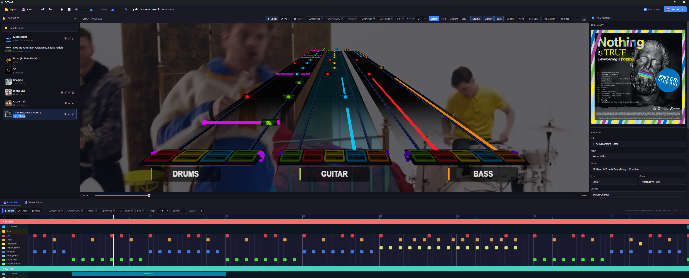
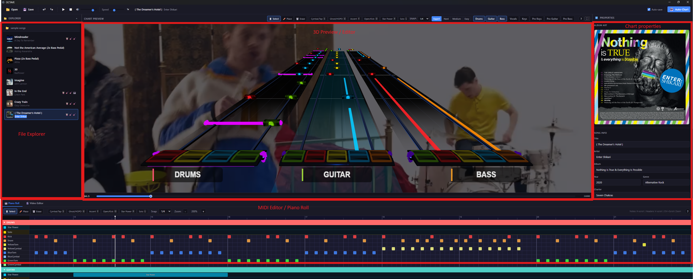

# OCTAVE

**Orchestrated Chart & Track Authoring Visual Editor**

A desktop chart editor for rhythm games like [YARG](https://yarg.in) and Clone Hero. Built with Electron, React, Three.js, and Zustand.

<!-- Screenshot: Full editor view with piano roll + 3D highway -->


---

## Installation

### Download (Recommended)

Grab the latest release for your platform from the [**Releases page**](https://github.com/opria123/octave/releases/latest):

| Platform | File |
|----------|------|
| **Windows** | `octave-x.x.x-setup.exe` |
| **macOS** | `octave-x.x.x.dmg` |
| **Linux** | `octave-x.x.x.AppImage` or `.deb` |

> **Windows**: You may see a SmartScreen warning on first launch — click "More info" → "Run anyway".
>
> **macOS**: Right-click the app and select "Open" if Gatekeeper blocks it.
>
> **Linux AppImage**: Run `chmod +x octave-*.AppImage` then `./octave-*.AppImage`.

### Build from Source

```bash
git clone https://github.com/opria123/octave.git
cd octave
npm install
npm run build:win    # or build:mac / build:linux
```

---

## How to Use

### Opening a Project

1. Launch OCTAVE
2. Click **File → Open Folder** (or drag a folder onto the window)
3. Select a folder containing your song files (`.mid` or `.chart` + audio stems)
4. Songs appear in the **Project Explorer** on the left — click one to load it

### The Editor Layout

<!-- Screenshot: Annotated editor layout -->


The interface has four main areas:

| Area | Description |
|------|-------------|
| **Toolbar** (top) | Playback controls, save/export, editing tools, snap division |
| **Project Explorer** (left) | Song browser with album art thumbnails |
| **Piano Roll** (center) | 2D note editor — one lane per instrument, canvas-based |
| **3D Highway** (right) | Real-time YARG-style highway preview |
| **Property Panel** (right) | Note inspector, metadata, tempo/time signature editor |

### Editing Notes

1. Select an **instrument** track in the piano roll (Guitar, Drums, Bass, etc.)
2. Choose a tool from the toolbar or press a hotkey:
   - `1` — **Select** (click notes, drag to multi-select, Ctrl+click to toggle)
   - `2` — **Place** (click to place a note, drag right to create a sustain)
   - `3` — **Erase** (click a note to delete it)
3. **Resize sustains** by dragging the right edge of a sustain note
4. Apply **modifiers** via the toolbar: HOPO, Tap, Cymbal, Ghost, Accent, Open

### Keyboard Shortcuts

| Shortcut | Action |
|----------|--------|
| `Space` | Play / Pause |
| `1` / `2` / `3` | Select / Place / Erase tool |
| `Ctrl+C` / `Ctrl+V` | Copy / Paste notes |
| `Ctrl+Z` / `Ctrl+Shift+Z` | Undo / Redo |
| `Ctrl+S` | Save |
| `Scroll` | Horizontal scroll through the chart |
| `Ctrl+Scroll` | Zoom in/out |

### Saving & Exporting

- **Ctrl+S** saves in the original format (`.mid` or `.chart`)
- Use **File → Export** to convert between formats
- OCTAVE preserves all metadata, tempo maps, and instrument data on round-trip

<!-- Screenshot: 3D highway close-up -->


---

## Features

### Multi-Format Support
- Import & export `.mid` (MIDI) and `.chart` (Clone Hero) files
- YARG-compliant sustain threshold handling (format-aware)
- Reads `song.ini` metadata

### 8 Instruments
- **Drums** — Pro Drums with cymbal/tom distinction
- **Guitar / Bass / Keys** — 5-fret charting
- **Vocals** — Pitched lyrics with 3 harmony parts, percussion, slides
- **Pro Keys** — Full MIDI range (C3–C5, 25 keys)
- **Pro Guitar / Pro Bass** — 6-string, frets 0–22

### Dual Editor Views
- **2D Piano Roll** — Canvas-based multi-lane MIDI editor with per-instrument tracks, beat grid, and snap quantization
- **3D Highway Preview** — Real-time Three.js highway with YARG-compatible note models, animated playback, hit effects, and strikeline visualization

### Editing Tools
- Select, Place, Erase tools (keyboard shortcuts `1` / `2` / `3`)
- Note modifiers: Cymbal/Tap, Ghost/HOPO, Accent, Open, Kick
- Star Power and Solo section authoring
- Sustain drag-to-resize handles
- Copy / Paste / Cut (`Ctrl+C` / `Ctrl+V`)
- Undo / Redo (`Ctrl+Z` / `Ctrl+Shift+Z`) — per-song scoped history
- Adjustable snap division (1/4 through 1/64 notes)
- Multi-difficulty editing (Expert, Hard, Medium, Easy)

### Audio & Playback
- Multi-stem audio mixing (loads all stems in a song folder)
- Variable playback speed
- Tempo-aware tick/time conversion with full tempo map support

### Project Management
- Multi-song project browser with album art thumbnails
- Autosave with configurable interval
- Dirty-state tracking
- Song metadata and tempo/time signature editing

## Development

### Prerequisites

- [Node.js](https://nodejs.org/) 18+
- npm

### Setup

```bash
npm install
npm run dev
```

### Scripts

| Command | Description |
|---------|-------------|
| `npm run dev` | Start in development mode with hot reload |
| `npm run build` | Type-check and compile |
| `npm run build:win` | Package for Windows (`.exe`) |
| `npm run build:mac` | Package for macOS (`.dmg`) |
| `npm run build:linux` | Package for Linux (`.AppImage`, `.deb`) |
| `npm run lint` | Run ESLint |
| `npm run typecheck` | Run TypeScript type checking |

## Tech Stack

| Layer | Technology |
|-------|-----------|
| Desktop Shell | Electron |
| Build Tool | electron-vite |
| UI Framework | React 19 + TypeScript |
| State Management | Zustand + Zundo (undo/redo) |
| 3D Rendering | Three.js via React Three Fiber |
| Audio | Web Audio API |
| MIDI Parsing | @tonejs/midi |
| Audio Processing | FFmpeg (via fluent-ffmpeg) |

## Project Structure

```
src/
├── main/           # Electron main process
├── preload/        # Preload scripts (IPC bridge)
└── renderer/
    └── src/
        ├── components/          # React components
        │   ├── MidiEditor.tsx   # 2D piano roll editor
        │   ├── ChartPreview.tsx # 3D highway preview
        │   └── chartPreviewModules/  # 3D scene modules
        ├── stores/              # Zustand state stores
        ├── services/            # Audio service
        ├── utils/               # Parsers, helpers
        └── types/               # TypeScript types & constants
```

## License

MIT
