# OCTAVE SNG Unpacker/Importer Implementation Plan

This document outlines the detailed plan for implementing a Node.js-based SNG Unpacker/Importer in OCTAVE. It is based on the format used by Clone Hero's `.sng` packaging process defined in `sngPacker.ts`.

---

## 1. Binary Layout and Decryption Steps

An `.sng` file is a packed, custom binary archive containing song metadata and XOR-encrypted song files.

### Binary Layout Specification (SNGPKG Version 1)

The file consists of a header and four sequential sections. All numeric values are little-endian.

```mermaid
gantt
    title SNGPKG Binary Layout
    dateFormat  X
    axisFormat %s
    section Header
    Magic (SNGPKG)            :active, 0, 6
    Version (uint32LE)        :active, 6, 10
    Seed (16 bytes)           :active, 10, 26
    section Metadata Section
    Meta Size (uint64LE)      :26, 34
    Meta Pairs Count (uint64LE):34, 42
    Key/Value Pairs           :42, 60
    section File Index Section
    Index Size (uint64LE)     :60, 68
    File Count (uint64LE)     :68, 76
    File Index Entries        :76, 100
    section File Data Header
    Payload Size (uint64LE)   :100, 108
    section File Data Payloads
    XOR Encrypted Payloads    :108, 150
```



#### A. Header (Offset 0 to 25)

- **Magic Identifier** (6 bytes, ASCII): `"SNGPKG"`
- **Version** (4 bytes, `uint32LE`): Must be `1` (or compatibility checks should fail).
- **Encryption Seed** (16 bytes, Binary): A random 16-byte seed used to generate the keystream.

#### B. Metadata Section (Offset 26 to `26 + 8 + metadataSectionLength`)

- **Metadata Section Length** (8 bytes, `uint64LE`): Size of the rest of the metadata section in bytes (excluding these 8 bytes).
- **Metadata Pairs Count** (8 bytes, `uint64LE`): Number of key-value pairs stored.
- **Key-Value Pairs**: Sequentially repeated for each pair:
  - `keyLength` (4 bytes, `int32LE`)
  - `key` (`keyLength` bytes, UTF-8 string)
  - `valueLength` (4 bytes, `int32LE`)
  - `value` (`valueLength` bytes, UTF-8 string)

#### C. File Index Section (Offset `34 + metadataSectionLength` to `34 + metadataSectionLength + 8 + fileIndexSectionLength`)

- **File Index Section Length** (8 bytes, `uint64LE`): Size of the rest of the index section in bytes (excluding these 8 bytes).
- **File Count** (8 bytes, `uint64LE`): Number of files packed in the SNG package.
- **File Catalog Entries**: Sequentially repeated for each file:
  - `nameLength` (1 byte, `uint8`): Length of the filename (maximum 255 bytes).
  - `name` (`nameLength` bytes, UTF-8 string).
  - `size` (8 bytes, `uint64LE`): File size in bytes.
  - `offset` (8 bytes, `uint64LE`): Absolute byte offset from the start of the SNG file where this file's payload begins.

#### D. File Data Header (8 bytes)

- **Payload Size** (8 bytes, `uint64LE`): The total length of the combined file payloads block.

#### E. File Data Payloads

- Starting at offset `absoluteHeaderSize = 26 + (8 + metadataSectionLength) + (8 + fileIndexSectionLength) + 8`.
- Contains the concatenated, XOR-encrypted data for all files listed in the File Index Section.

---

### Decryption Steps

To decrypt the file payloads, a 256-byte keystream must be generated from the 16-byte seed, and each file's payload must be XORed byte-by-byte.

> [!IMPORTANT]
> **Bug Correction Alert**:
> In previous plan drafts, the keystream indexing was incorrectly aligned to the absolute file offset (`(file.offset + i) % 256`).
> According to the actual packing logic in `sngPacker.ts`, the keystream is aligned to the **start of each individual file**.
> Thus, decryption for each file must use a **0-indexed** position relative to the file payload's start (`i % 256`).

#### 1. Keystream Generation Algorithm

```typescript
function generateKeystream(seed: Buffer): Buffer {
  const keystream = Buffer.alloc(256)
  for (let i = 0; i < 256; i++) {
    keystream[i] = seed[i % 16] ^ i
  }
  return keystream
}
```

#### 2. Decryption Cipher (Symmetric XOR)

For a file starting at absolute offset `offset` and of size `size`:
$$\text{decrypted}[i] = \text{encrypted}[i] \oplus \text{keystream}[i \pmod{256}]$$
Where $i$ is the byte index from `0` to `size - 1` of the current file's payload.

---

## 2. Metadata Extraction to `song.ini`

SNG packages store metadata values (like song title, artist, charter, etc.) internally as key-value pairs. Standard song libraries require this metadata to be structured under a `[song]` header in a `song.ini` file.

### Metadata Parsing & Construction Steps

1. Parse the key-value pairs from the Metadata Section.
2. Group all keys under the `[song]` section.
3. Un-normalize boolean values if needed, or write them as standard ini strings. (Note: Clone Hero parses booleans as `"True"` or `"False"`, which are already normalized by the packer).
4. Write the key-value pairs sequentially.

### Example Node.js Parser Function

```typescript
function buildIniContent(metadata: Record<string, string>): string {
  let ini = '[song]\n'
  for (const [key, value] of Object.entries(metadata)) {
    ini += `${key} = ${value}\n`
  }
  return ini
}
```

---

## 3. Extracting Note Charts and Audio Stems

Because audio stems (`.ogg`, `.mp3`, `.wav`) and video background files can be large, loading entire file buffers into memory should be avoided. A stream-based decryptor allows memory-efficient unpacking.

### Stream-based File Extraction

Using Node.js `fs.createReadStream` with inclusive `start` and `end` bounds, we can read only the file slice and process it through a custom `Transform` stream.

#### Custom Decryption Transform Stream

```typescript
import { Transform, TransformCallback } from 'stream'

class SngDecryptTransform extends Transform {
  private keystream: Buffer
  private bytesProcessed = 0

  constructor(keystream: Buffer) {
    super()
    this.keystream = keystream
  }

  _transform(chunk: Buffer, encoding: string, callback: TransformCallback): void {
    for (let i = 0; i < chunk.length; i++) {
      // Keystream alignment is relative to the start of this specific file
      const fileIndex = this.bytesProcessed + i
      chunk[i] ^= this.keystream[fileIndex % 256]
    }
    this.bytesProcessed += chunk.length
    this.push(chunk)
    callback()
  }
}
```

#### Extraction Implementation Loop

```typescript
import * as fs from 'fs'
import * as path from 'path'
import { pipeline } from 'stream/promises'

interface FileEntry {
  name: string
  size: bigint
  offset: bigint
}

async function extractFiles(
  sngPath: string,
  files: FileEntry[],
  keystream: Buffer,
  outputDir: string
): Promise<void> {
  for (const file of files) {
    const outputPath = path.join(outputDir, file.name)

    // Create a read stream for the exact slice of the SNG file
    const readStream = fs.createReadStream(sngPath, {
      start: Number(file.offset),
      end: Number(file.offset) + Number(file.size) - 1
    })

    const decryptStream = new SngDecryptTransform(keystream)
    const writeStream = fs.createWriteStream(outputPath)

    // Pipe the data through decrypt stream and write to disk
    await pipeline(readStream, decryptStream, writeStream)
  }
}
```

---

## 4. Directory Structure of Extracted Output

To maintain a clean song library and prevent operating system errors from invalid file paths, the output directory must be carefully managed.

### Target Directory Layout

In the target song library, each song must be extracted into its own folder:

```
songLibrary/
  └── <Artist> - <Song Name>/
      ├── song.ini           (Reconstructed metadata file)
      ├── notes.chart        (or notes.mid - decrypted note chart)
      ├── song.ogg           (decrypted main audio mix)
      ├── guitar.ogg         (decrypted guitar track, if present)
      ├── rhythm.ogg         (decrypted rhythm track, if present)
      ├── bass.ogg           (decrypted bass track, if present)
      ├── drums.ogg          (decrypted drums track, if present)
      ├── vocals.ogg         (decrypted vocals track, if present)
      ├── keys.ogg           (decrypted keys track, if present)
      ├── crowd.ogg          (decrypted crowd audio, if present)
      ├── preview.ogg        (decrypted song preview, if present)
      ├── album.png/.jpg     (decrypted album artwork, if present)
      └── ...
```

### Folder Name Sanitization

To prevent illegal directory name characters (such as `/`, `\`, `?`, `*`, `|`, etc.) from throwing write errors:

1. Extract `artist` and `name` from the parsed SNG metadata.
2. Fall back to `"Unknown Artist"` and `"Unknown Song"` if missing.
3. Clean the directory name using a regex.

```typescript
function sanitizeDirName(name: string): string {
  return name.replace(/[\\/:*?"<>|]/g, '_').trim()
}

function getSongFolderName(metadata: Record<string, string>): string {
  const artist = metadata.artist || 'Unknown Artist'
  const name = metadata.name || 'Unknown Song'
  return sanitizeDirName(`${artist} - ${name}`)
}
```

### Unpacking Workflow Orchestrator

```typescript
import * as fs from 'fs/promises'
import { existsSync } from 'fs'

export async function importSng(sngFilePath: string, libraryDir: string): Promise<string> {
  const buffer = await fs.readFile(sngFilePath) // Or read headers in chunks for very large SNGs

  // 1. Validate magic header
  const magic = buffer.subarray(0, 6).toString('ascii')
  if (magic !== 'SNGPKG') {
    throw new Error('Invalid file format: Magic signature "SNGPKG" not found.')
  }

  const version = buffer.readUInt32LE(6)
  if (version !== 1) {
    throw new Error(`Unsupported SNG version: ${version}. Only version 1 is supported.`)
  }

  // 2. Derive Keystream
  const seed = buffer.subarray(10, 26)
  const keystream = generateKeystream(seed)

  // 3. Parse Metadata
  let cursor = 26
  const metaSecLen = Number(buffer.readBigUInt64LE(cursor))
  cursor += 8

  const metadataCount = Number(buffer.readBigUInt64LE(cursor))
  let metaOffset = cursor + 8
  const metadata: Record<string, string> = {}

  for (let i = 0; i < metadataCount; i++) {
    const keyLen = buffer.readInt32LE(metaOffset)
    metaOffset += 4
    const key = buffer.subarray(metaOffset, metaOffset + keyLen).toString('utf-8')
    metaOffset += keyLen

    const valLen = buffer.readInt32LE(metaOffset)
    metaOffset += 4
    const val = buffer.subarray(metaOffset, metaOffset + valLen).toString('utf-8')
    metaOffset += valLen

    metadata[key] = val
  }
  cursor += metaSecLen

  // 4. Parse File Index
  const fileIndexSecLen = Number(buffer.readBigUInt64LE(cursor))
  cursor += 8

  const fileCount = Number(buffer.readBigUInt64LE(cursor))
  let idxOffset = cursor + 8
  const files: FileEntry[] = []

  for (let i = 0; i < fileCount; i++) {
    const nameLen = buffer.readUInt8(idxOffset)
    idxOffset += 1
    const name = buffer.subarray(idxOffset, idxOffset + nameLen).toString('utf-8')
    idxOffset += nameLen

    const size = buffer.readBigUInt64LE(idxOffset)
    idxOffset += 8
    const offset = buffer.readBigUInt64LE(idxOffset)
    idxOffset += 8

    files.push({ name, size, offset })
  }

  // 5. Create Target Directory
  const songFolderName = getSongFolderName(metadata)
  const targetDir = path.join(libraryDir, songFolderName)
  await fs.mkdir(targetDir, { recursive: true })

  // 6. Write song.ini
  const iniContent = buildIniContent(metadata)
  await fs.writeFile(path.join(targetDir, 'song.ini'), iniContent, 'utf-8')

  // 7. Extract & Decrypt Files
  await extractFiles(sngFilePath, files, keystream, targetDir)

  return targetDir
}
```
